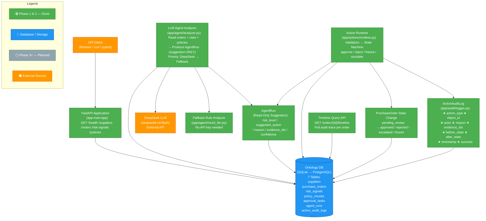

# 系统架构图

> Mini Foundry Ontology Action Runtime — Enterprise Procurement Risk Review

---

## 整体架构（Mermaid）



---

## 数据流说明

### Phase 1（已实现）

```text
Client ──GET──▶ FastAPI ──Query──▶ Ontology DB
                    │
                    ▼
              JSON Response
         (SupplierRead / OrderDetail / RiskSignalRead / PolicyChunkRead)
```

### Phase 2（已实现）

```text
1. Agent Analyzer 读取订单 + 风险信号 + 政策
2. 优先调用 DeepSeek LLM 生成分析建议
3. 若 DeepSeek 不可用（无 Key / 网络故障 / 超时 / 格式异常）→ 自动降级到 Fallback Rule Analyzer
4. 写入 AgentRun（READ-ONLY，不可直接修改订单状态）
5. Action Runtime 读取 AgentRun 建议
6. 执行校验器 → 状态机判定
7. 写入 PurchaseOrder 新状态 + ActionAuditLog（before/after 快照）
8. Timeline Query 按 order_id 查询完整审计链路
```

---

## 关键设计约束

| 约束 | 说明 |
|------|------|
| **AgentRun 只读** | Agent 只能写入 `agent_runs` 表，**禁止**直接修改 `purchase_orders.status` |
| **Action Runtime 唯一写入口** | 所有状态变更必须通过 Action Runtime 执行 |
| **审计闭环** | 每次状态变更写入 `action_audit_logs`，包含 before/after 快照 |
| **幂等 Seed** | `scripts/seed_data.py` 可重复运行，已有记录自动跳过 |

---

## 实体关系

```text
Supplier (1) ────< (N) PurchaseOrder
PurchaseOrder (1) ────< (N) RiskSignal
PurchaseOrder (1) ────< (N) ApprovalTask
PurchaseOrder (1) ────< (N) AgentRun
PolicyChunk ──(via evidence_ids)──▶ AgentRun / ActionAuditLog
ActionAuditLog ──(via object_id)──▶ PurchaseOrder
```
